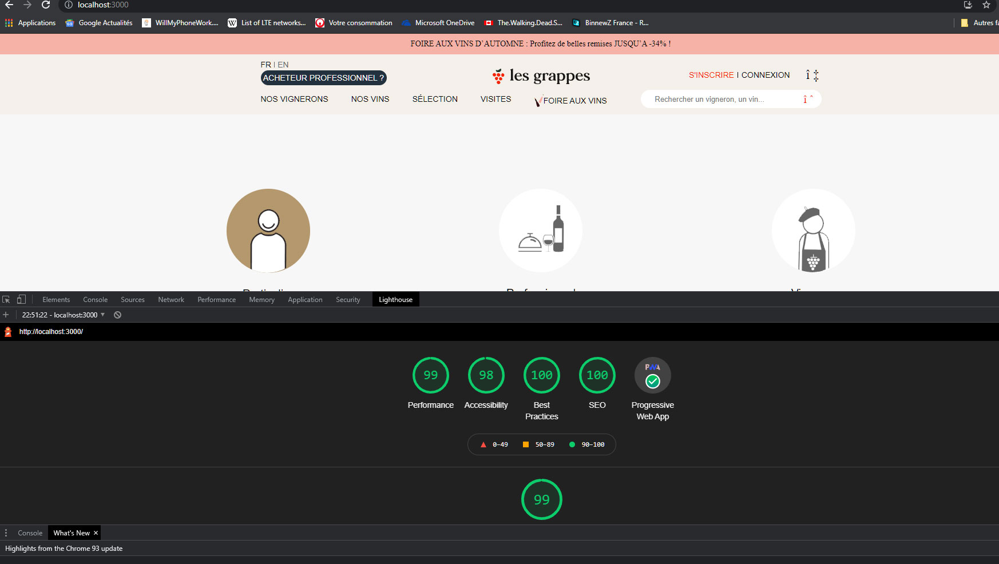

# Test intégration Les grappes


## Installation

Utilisez le gestionnaire de paquets de votre choix.

```bash
npm install
```
or
```bash
yarn install
```

## Usage

Lancer le serveur de développement :

```bash
npm run dev
```
or
```bash
yarn dev
```
### Le score au niveau des indicateurs de chrome lighthouse Desktop : 99 et Mobile : 90


[](https://Cecile-Bordes.github.io/les-grappes/Rendu/)

## Fichiers

Mon html dans /index.html

Mon javascript dans /main.js

Mes assets dans le dossier /assets (sass, css, images, fonts...)